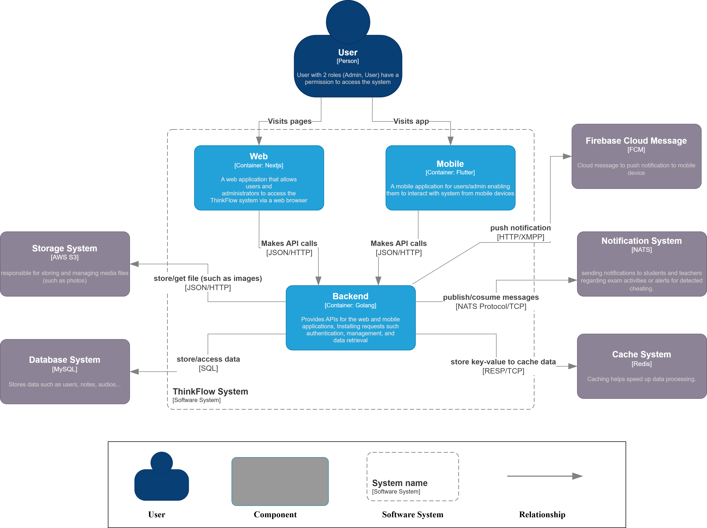

# ThinkFlow - AI-Powered Voice Notes, Summarization, and Mind Map Generation

## Table of Contents

-   [Project Overview](#project-overview)
-   [Project Background and Motivation](#project-background-and-motivation)
-   [Features](#features)
-   [System Architecture](#system-architecture)
-   [Installation Guide](#installation-guide)
-   [Repository Links](#repository-links)
-   [Security Notes](#security-notes)

## Project Overview

### Purpose of Document

This document provides a comprehensive overview of the ThinkFlow project, including:

-   Project purpose and scope
-   Business needs and problem identification
-   System architecture and proposed solutions
-   Project resources, schedule, and budget overview

### Project Goal

ThinkFlow is a cross-platform intelligent note-taking application designed to revolutionize how users capture and organize information. The project aims to create an AI-powered system that enhances productivity through:

-   Voice-to-text conversion with regional accent recognition
-   Automatic content summarization
-   Interactive mind map generation
-   AI-powered smart search capabilities
-   Cross-platform synchronization
-   Collaboration features

## Project Background and Motivation

In today's fast-paced digital world, effective note-taking is crucial for productivity, learning, and collaboration. Traditional note-taking methods often prove inefficient, especially when handling large volumes of information from diverse sources like meetings, lectures, voice recordings, and scanned documents.

ThinkFlow addresses these challenges by integrating advanced technologies:

-   Speech recognition for efficient voice-to-text conversion
-   AI-powered text summarization
-   Automated mind map generation
-   Smart search functionality
-   Seamless cloud synchronization

## Features

### User Features

-   Authentication and personalized note-taking
-   Document creation and formatting
-   Voice recording with accent recognition
-   AI-powered content summarization
-   Mind map generation
-   Cross-device synchronization

### Collaborator Features

-   Shared note access and editing
-   Collaboration on documents
-   Interactive mind map co-editing

### Admin Features

-   User account management
-   Role-based access control
-   Cloud storage administration
-   System performance monitoring

## System Architecture
### System Context Diagram


_High-level system context diagram showing all external integrations_

### C4 Model Documentation

#### Container Diagram


_Container diagram showing the high-level technical building blocks_

#### Component Diagrams


The following sections contain detailed component diagrams for each container:


_Authentication and Authorization Container_


_User Management Container_


_Note Management Container_


_Media Processing Container_


_Collaboration Container_


_Content Generation Container_


_Notification System Container_


_AI Processing Container_

### Allocation View


_System allocation view showing deployment architecture_

### Database Design


_Database schema and relationships diagram_

## Installation Guide

1. Install Docker and Docker Compose

2. Create environment file:

    ```bash
    cp .env.example .env
    ```

    Update the `.env` file with your actual configuration values.

3. Build and run with Docker Compose:

    ```bash
    docker-compose up --build -d
    ```

4. Access the application:
    - Web Interface: `http://localhost`
    - API Gateway: `http://localhost:8080`

## Repository Links

-   Frontend Mobile: [Think_Flow_App](https://github.com/ngb4o/Think_Flow_App)
-   Frontend Web: [thinkflow-web](https://github.com/ThuyTam241/thinkflow-web)

## Security Notes

-   NEVER commit `.env` file to the git repository
-   Keep all credentials secure and never share them
-   Implement regular credential rotation for enhanced security
-   Follow security best practices for API key management
